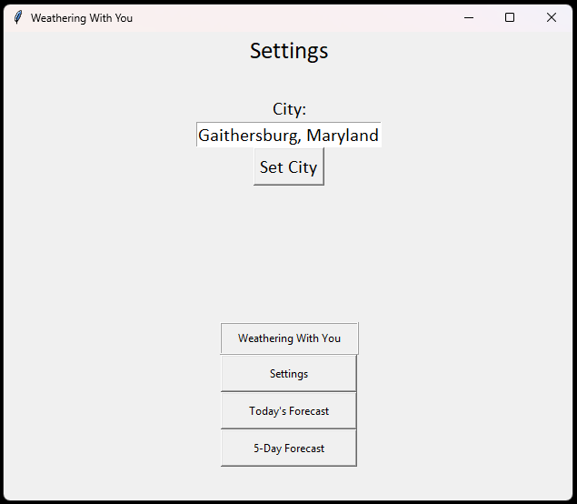
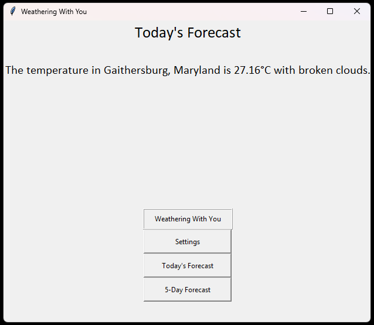
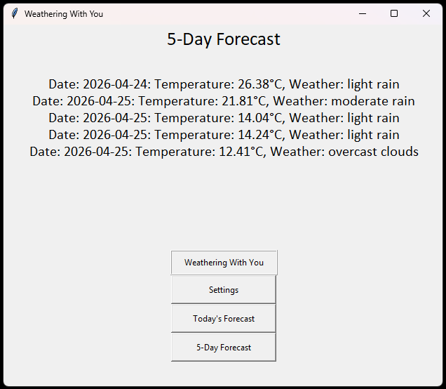

# Weather App

A desktop weather application built with Python and Tkinter that 
fetches real-time weather data by city name using the OpenWeatherMap API.

## Technologies Used

- Python
- Tkinter
- OpenWeatherMap API

## Features

- Enter a city name to retrieve weather data
- Page 2: Today's forecast — displays city name, temperature, and weather description
- Page 3: 5-day forecast — displays five consecutive dates, temperatures, and weather descriptions
- Multi-page navigation with buttons

## Screenshots

## Setup & Installation

1. Clone the repository
2. Install dependencies:
   pip install requests
3. Add your OpenWeatherMap API key to the project
4. Run the app:
   python main.py

## My Contribution

Solo personal project built independently outside of coursework.

## Lessons Learned

- Gained hands-on experience consuming a REST API and handling JSON responses
- Practiced cross-class method interactions and multi-page Tkinter navigation
- Learned how to dynamically update UI labels based on API data

## Status & Roadmap

- Add temperature unit toggle between Kelvin, Celsius, and Fahrenheit
- Support more specific location input using city, state code, and country code to resolve ambiguous city names
- UI redesign and visual improvements planned
